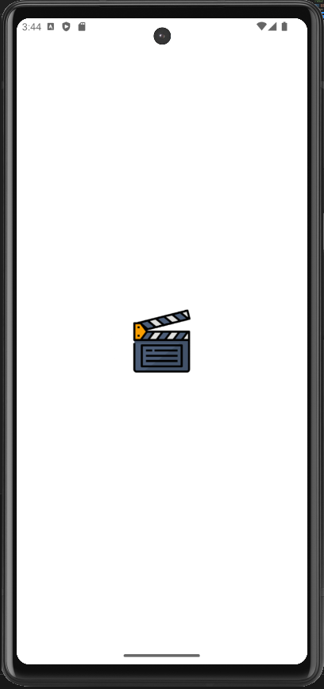
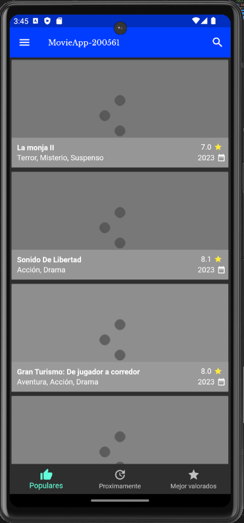
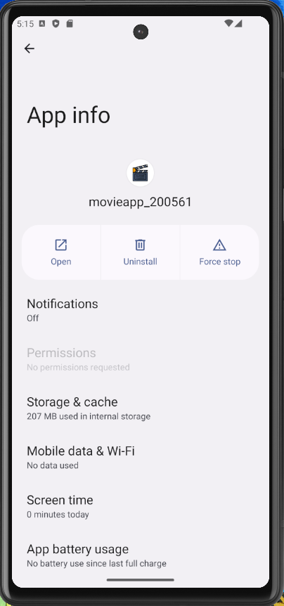

# DMI_Practica11_200561

  
# Universidad Tecnológica de Xicotepec de Juárez

## Ingeniería en Desarrollo y Gestión de Software
## Elisama Arturo Calva Moreno
## 10A
### Desarrollo Móvil Integral

## Capturas de Pantalla

  
  
  
  

&nbsp;
&nbsp;

|  Característica |  Información |
| :------------: | :------------: |
| Nombre  |  Practica 11: Implementación de navegación entre Series de TV y Películas. |
| Descripción  | Esta aplicación fue creada con Flutter con la finalidad de poder mostrar un ejemplo sencillo de la aplicación que brinda acceso directo a las peliculas y series del momento. Esta aplicación permite explorar un catálogo de expansión y películas, series.Esta aplicacion el el nombre de "MovieAPP," puede acceder a información detallada sobre cada título y sus fechas de lanzamiento. Además, disfrutar de una integración fluida con tus servicios de transmisión preferidos, permitiéndote ver películas y episodios directamente desde la aplicación. Su interfaz de usuario elegante y fácil navegación garantiza una experiencia intuitiva y gratificante. Para este nuevo avance se realizaron mejoras en la app como un margen entre cada imagen para hacer que se ve vea mas estetico y se agrego una portada de cada película, como también texto con el respectivo titulo de las películas con un prototipo de numero de estrellas y fecha de lanzamiento, también se incorporo una imagen de carga al momento de refrescar las portadas de las películas,tabien a esta imagen de carga se le hizo un ajuste para que concuerde con el tamaño de la aplicacion.  |
|  Fecha de Carga | 13/10/23  |

&nbsp;
&nbsp;

&nbsp;
&nbsp;

 
 
 
 

&nbsp;
&nbsp;
